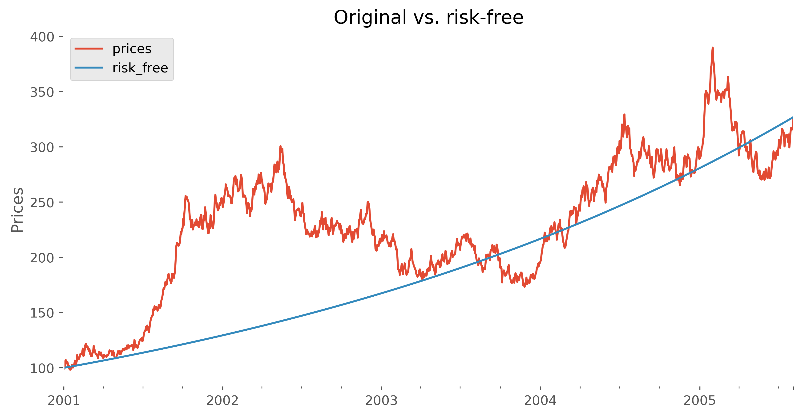
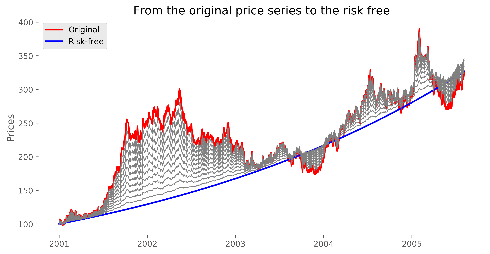
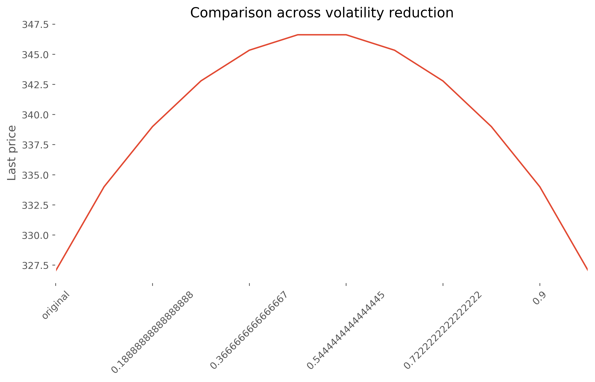

# *Quant-Ocean*
Financial research, hacks and tips.

# Usage
In each folder you can find a `requirements.txt` file to reproduce the Python
environment where the notebooks and scripts run. 

---

# Table of Contents

## From Real to Risk-Free

From a prices time series we aim at creating all the space of price series
between the original one and its corresponding risk-free annualized series.

We achieve such transition by removing volatility within the returns time series.

### Observations
Interestingly, the the last price (and thus the total return) of the transition
curves is higher in the middle of the transition. 

