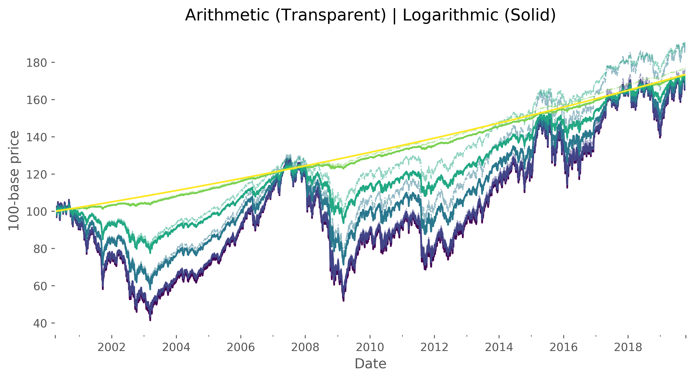

# *Quant-Ocean*
Financial research, hacks and tips.

---

# Table of Contents

## From Real to Risk-Free

From a prices time series we aim at creating all the space of price series
between the original one and its corresponding risk-free annualized series.

