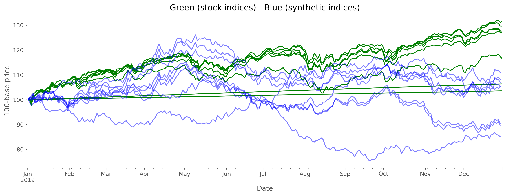
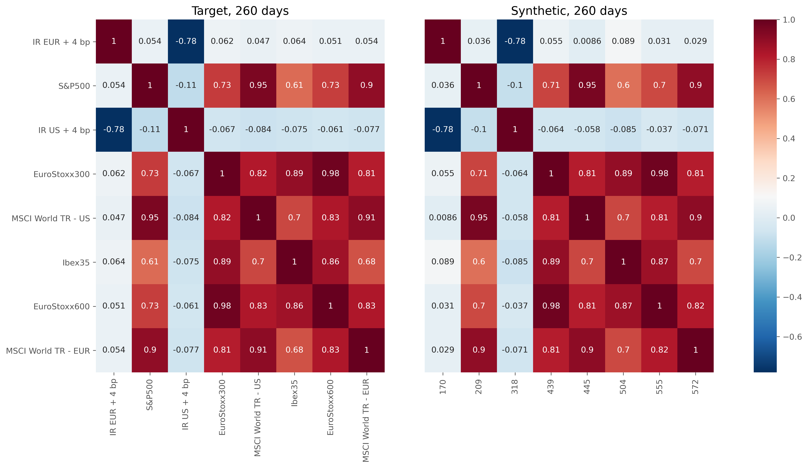

# Methodological Testing: have you correctly coded the trading the idea you had in mind?

In one way or another, most quantitative models somehow seek to find and exploit relationships between two or more series of returns.

Therefore, the usual pipeline has a timeseries go through mathematical procedures which condensate in a couple of figures meaningful information: the expected mean, volatility, drawdowns, runups, correlations, among others. That is, the space of returns, large and noisy, is projected into a smaller space: performance and risk metrics.

Today's post begins a series whose aim is to climb the ladder the other way around: generate returns with specific risk metrics with the least amount of complexity needed. Why would someone want to do that? To take test driven development to the next step: methodological testing. 

> Methodological testing proves you implemented the concepts you built the code for. 

Unit tests validate deterministic code, by establishing a link between expected and resulting outcome of code instructions with respect to some inputs. This is great, and every serious production-ready code should have them. Additionally, they can be used when migrating code from one language to another. 

However, they do not validate those instructions actually encode the idea that gave birth to them on the first place. If you are clustering assets according to some given risk metrics and you want to test your code, you need to know in advance which assets are close within that cluster. That is, you would need to generate the inputs such that the distance matrix of your cluster is the one you would expect.

> Figure: Cluster and distance matrices

## Correlation as a distance

To start off, we selected a famous distance metric: the Pearson correlation between returns. 

To generate randomly distributed returns with specific correlations between them, one can leverage the Cholesky decomposition of a matrix [1]. 

Given a correlation matrix $\Sigma$ and its Cholesky factorization $\Sigma = LL^{T}$, one can define the mapping $Y = LX$ which will give the vector $Y$ of correlated vectors according to $\Sigma$ (see proof here).

The algorithm steps are:

1. Build uncorrelated and **mean-centered** random variables $X$.
1. Build/fetch a correlation matrix $\Sigma$. 
1. Obtain the Cholesky factorization.
1. Apply the mapping $Y = LX$ to get $Y$.
1. Validate by checking the differences between the empirical correlation matrix given by $Y$ and the original target correlation $\Sigma$.

### Market returns vs. synthetic returns

A numerical showcase is carried out: the target correlation matrix is obtained from the correlation matrix of several stock indices.

Pretty good. Yet, the correlation matrix here was given, uncontrollable. 

## Generating your own scenario

The previous algorithm, despite its apparent simplicity, hides a small dose of complexity. As I mentioned at the beginning of the post, we would like to generate *specific situations* for which we want to test our trading algorithm. 

That means that we have to build a correlation matrix with the specific structure we want to exploit. By doing so, we could anticipate which assets our code should pick for us, since we created their returns to fit the distance on the first place. 

And this ain't so easy. When building a correlation matrix one must comply to the following properties:

1. Unit diagonal elements.
1. Symmetric.
1. Off-diagonal values in the interval [-1, 1]. 
1. Semi-definite positive *(... mmm?)*.

The first three properties are easy to obtain by construction, but the fourth is not necessarily given. 

For symmetric matrices, one can check their positiveness through the sign of their eigenvalues (which by the way will always be real). If all of them are larger or equal to zero, you have a semi-positive definite matrix. 

Oh, oh. Positiveness is not so easy to achieve after all. 

And these are randomly generated matrices, what could happen if we had imposed on them some structure?

Luckily, there are procedures to find the closest semidefinite matrix to a given matrix. It is the field of *Matrix Nearness Problems* [2], and we will talk about them and compare two of them in the next session. Many interesting facts about the meaning of correlation arise when the closest matrix is found. 

Thanks for reading! 

### References
	
* [1] G. Golub, and C. van Loan. *Matrix Computations*. JHU Press, Fourth edition (2013)

* [2] Higham, Nicholas. (2000). *Matrix Nearness Problems and Applications.*