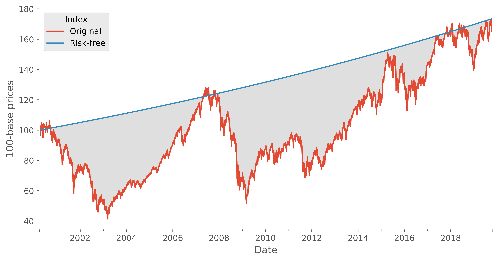
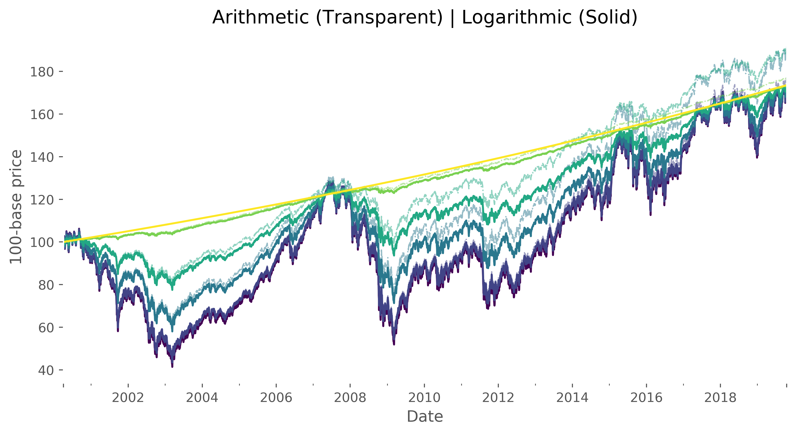

# The Direct Implications of Logarithmic and Arithmetic Returns

As Nassim Taleb states, *ideas come and go, stories stay.* 

So today @mmngreco and myself are going to build for you a story which hopefully will carve in your
mind the importance of doing things right; or put differently, of using 
logarithmic returns instead of arithmetic returns when you should.  

To do so, I will use a common process carried out in Finance: *return annualization*. We will build on top of it some concepts 
and finally end up showing the importance of using logarithmic returns.

As a personal disclaimer, **this is a purely mathematical post**, expect no 
direct application, but rather understanding of the internal nature of the 
concepts we deal with every day.

## The Annualization Process

The return annualization process answers the following question: 
for a given time period and a total return achieved in it, for a given partition
of this period, which is the *constant return* for each segment such that I end
up with the same return?

For example, if my asset (understood as a sequence of returns) has achieved a 
total return of 152% in 10 years, what is the return it should have had *every
year* in the past 10 years to end up with the same 152% return?

The solution to this question is a simple geometrical mean, where the exponential
factor will be **the number of segments** in which we divide our period. For our
example, it would be:
$$ 
r_{1Y} := (1+152%)^{\frac{1}{9}} - 1 = 10.82% 
$$

Indeed, if you compound that figure for 10 years you end up with the exact 152%. 

(Watchout with the typical [fence post mistake](https://betterexplained.com/articles/learning-how-to-count-avoiding-the-fencepost-problem/), the annualization factor
is 1/9 and not 1/10!).

### Generalization

The previous operation is the usual one when analysts compare funds, portfolios
or indices with several years of track record. However, if you stop and think 
about it, you can take it even further and breakdown the return to the daily
scale, which will give you the daily return an asset would have each trading day
to arrive to the same point 10 years later.

We will call this return $a_T$, the annualized return to a daily basis,
and as you might have guessed, it can be computed by setting the annualization 
factor to 
$$
\frac{1}{T-1},
$$
where $T$ is the total number of days.

## The (Mathematical) Risk-Free Curve

And when you think about, you have just defined a mathematically perfect **risk-free curve** that gets 
you to the same point as the original market-like price series.
Why is it risk-free? Because the daily returns of this series have *zero variance*
for the whole period of evolution.

Of course, this isn't the risk-free curve you will encounter out there. In the industry, 
most will refer to the risk-free asset or curve as the one drawn by sovereign bonds,
or the interest rate of the central bank of the region. But those are not purely
risk-free curves, as their value fluctuates with time. 

Summing up, it is risk-free in mathematical terms, but **it is also an ex-post curve**, which means 
you won't ever achieve such path, as we found it once the market realization has taken place. 

## The Sequence of Annualization Curves

Great, so now we have a price series and its risk-free equivalent. Both
of them have the same total return, but one has had volatility completely sucked
out from it.

And so a funny question comes through: 

*What is going on in the gap between these two curves?*

Whatever lies in there, it must satisfy two conditions:
1. Preserve the total return.
1. Have less volatility than the original series but more than the risk-free.

Let's have a look at how we can compute that collection of annualization curves.

### Returns Interpolation

To generate those sequences of curves, we will directly attack the daily returns 
of the original curve. In fact, we will modify each return via a simple linear
interpolation between the original value and the annualized one. 

#### Arithmetic Returns

And you know what, there is nothing as breaking something to understand how it
works. So let's go ahead and *naively* start with arithmetic returns:
$$
\hat{r}_t(\varepsilon) = (1 - \varepsilon) r_t + \varepsilon a_T
$$

The *cumulative product* of this new sequence of returns $1 + \hat{r}_r(\varepsilon)$ 
will lead to new price series which will hopefully lie in the space between the 
original and the risk-free curves.

 
This looks like the kind of thing we are after, but something went wrong ...
**they do not end up in the same point!**

#### Logarithmic Returns

Before going into what happened there, let's give it another try, this time
with the logarithmic returns:
$$
\ln\left(1+\hat{r}_t(\varepsilon)\right) = (1-\varepsilon) \ln \left(1 + r_t\right) + \varepsilon \ln \left(1 + a_T\right)
$$

Now the transformation seems to be working properly! The curves decrease in 
volatility as the parameter $\varepsilon$ increases, but they also end up in the 
same spot as the original price series.

### What Is Going On?

So now that we have solved our problem, let's analyze what went wrong with
the first attempt. Let's go back into our own steps, to see if we can spot where
is the subtle mistake:

1. We took a price series.
1. We computed its total return.
1. We computed *the geometrical mean* of that total return with a factor equal
to the number of days minus one. We named this the annualized return to a daily basis. 
1. We linearly interpolated the arithmetic/logarithmic returns for each day between
the original return and its annualized counterpart. 
1. We compounded these new returns to generate new price series.

The issue is between steps three and four. To see why, we expand and rearrange
the two previous formulas making use of logarithmic properties and so on:
$$
(1+\hat{r}_t) = (1 + r_t) + \varepsilon(a_T - r_t),
$$
$$
(1+\hat{r}_t) = (1 + r_t)^{1-\varepsilon} \cdot (1+a_T)^{1-\varepsilon}.
$$
The first equation is the new absolute return using the annualized return as a 
linear correction factor. 

Instead, the second equation is the new absolute return *as a geometrical
average* between the absolute returns of the original series and the 
annualized one.

If you take logarithms in the second expression and expand the terms, the 
$\varepsilon$ term cancels out and you end up finding out that for any of its values
you will always preserve the total return. 

Instead, the first equation is using the annualized return, which is nothing
but a geometrical mean, in the middle of arithmetic returns! That's why the total
return is not preserved, we are not adding *the same kind* of returns.

#### Volatility

Interestingly, when the volatility of each new sequence of returns for each 
interpolation strategy is computed, we get again a surprising result: both
strategies generate series with the same volatility for each value of 
$\varepsilon$.

# Conclusions

